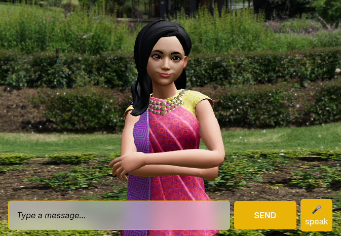

# 🧠 VIBE – Emotion-Aware 3D AI Companion (Frontend)

**VIBE** is a cross-platform, emotion-intelligent 3D avatar companion that interacts with users in real time, providing mental wellness support through emotionally adaptive conversations. This repository contains the frontend implementation of VIBE built using **React** for web.

---

## 🚀 Demo

> 🌐 **Live Web Demo**: [Coming Soon]  

---

## 🎯 Key Features

- 🗣️ **Voice-Based Interaction** (STT & TTS)
- 😃 **Emotion Detection** via facial expression & voice stress
- 🤖 **3D Avatar** built with Three.js (Web)
- 🌍 **Multilingual Support** – English, Hindi, Telugu
- 📈 **Mood Tracking Dashboard** – Visual feedback of emotional trends
- 🔐 **Privacy-First Architecture** – No cloud data storage by default

---

## 🧩 Tech Stack

| Platform | Tech Used |
|----------|-----------|
| Web      | React, Three.js, TailwindCSS, Web Speech API |
| Avatar   | Blender (Modeling), Three.js (Animation & Display) |
| API      | Node.js backend |

---

## 🖼️ Screenshots



---

## 🛠️ Installation & Setup

### React Web

```bash
git clone https://github.com/Venkatesh2007/vibe-frontend.git
cd vibe-frontend/
npm install
npm run dev
# vibe-frontend
